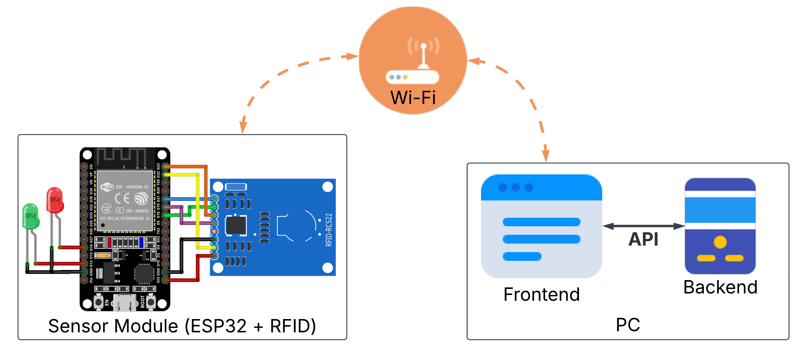
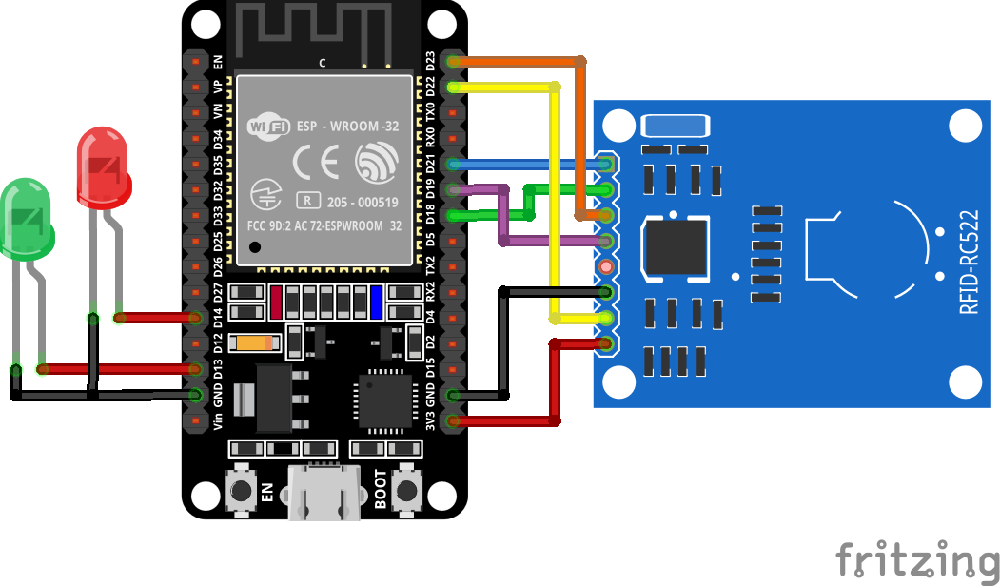

# RFID Attendance System

## 📌 Overview
This project is an **RFID-based attendance system** using an **ESP32**, **RFID reader (RC522)**, and a **web interface**. Users can scan their RFID badges to **check-in/check-out**, and the system records their attendance.

The project consists of:
- **ESP32 + RFID Module** for scanning badges.
- **WiFi communication** to send scanned UIDs to a **backend server**.
- **Backend server (Node.js & SQLite)** for processing and storing attendance records.
- **Frontend web interface** for user management and attendance tracking.

## 🏗️ System Architecture


The **ESP32 RFID module** reads the badge UID and sends it over **WiFi** to the **backend server**, which processes the data and updates the **attendance database**. The frontend **retrieves and displays attendance records** using an API.

## 🔌 Hardware Setup


### **Required Components:**
- ESP32 **(WiFi-enabled microcontroller)**
- **MFRC522 RFID Module**
- **RFID Badges**
- **2 LEDs (Red & Green)**
- **Jumper Wires**
- **Power Supply (USB or 3.3V Battery)**

### **ESP32 & RFID (RC522) Wiring:**
| **RFID RC522** | **ESP32**  |
|---------------|-----------|
| **SDA (SS)**  | GPIO **21** |
| **SCK**       | GPIO **18** |
| **MOSI**      | GPIO **23** |
| **MISO**      | GPIO **19** |
| **IRQ**       | **Not connected** |
| **GND**       | **GND** |
| **RST**       | GPIO **22** |
| **3.3V**      | **3.3V** |

---

## 📂 Project Structure
```
rfid-attendance/
|
├── esp32/              # ESP32 MicroPython code
│   ├── boot.py         # Main ESP32 program 
│   └── mfrc522.py      # RFID module driver
|
├── pc/                 # Computer-side application
│   ├── backend/        # Backend server (Node.js & SQLite)
│   │   ├── server.js   # Main backend logic
│   │   ├── package.json # Dependencies
│   ├── frontend/       # Web interface (HTML, JavaScript)
│   │   ├── index.html  # User interface
│   │   ├── script.js   # Frontend logic
```

---

## 🚀 Features
✅ **RFID badge scanning** using ESP32.  
✅ **WiFi communication** with a backend server.  
✅ **Web interface** to register new users and view attendance.  
✅ **SQLite database** to store registered users and check-in/out history.  
✅ **Live badge scanning** for adding new users.  
✅ **Visual LED feedback** (green for success, red for failure).  

---

## 🛠️ Setup & Installation

### 1️⃣ Clone the Repository
```sh
git clone https://github.com/muhamm-ad/rfid-attendance.git
cd rfid-attendance
```

### 2️⃣ Install Dependencies (Backend)
```sh
cd pc/backend
npm install
```

### 3️⃣ Start Backend Server
```sh
node server.js
```
By default, the backend runs at:
```
http://localhost:3000
```

### 4️⃣ Open the Web Interface
Simply open:
```
pc/frontend/index.html
```

### 5️⃣ Deploy ESP32 MicroPython Code
1. **Flash MicroPython** onto ESP32.
2. Use **Thonny** or **ampy** to upload files:
    ```sh
    ampy --port <PORT> put esp32/boot.py
    ampy --port <PORT> put esp32/mfrc522.py
    ```
3. Restart the ESP32.

---

## 📡 How It Works
1. **User scans badge** on the **ESP32 RFID reader**.
2. **ESP32 sends UID** to the server (`/attendance`).
3. **Web app displays the UID** for registration.
4. **User enters name & registers badge**.
5. **Future scans automatically check-in/check-out the user**.
6. **Attendance history is stored in an SQLite database**.

---

## 🔄 API Endpoints
| Method  | Endpoint       | Description |
|---------|---------------|-------------|
| `POST`  | `/scan/start` | Start scanning for an RFID badge |
| `POST`  | `/scan/stop`  | Stop scanning for RFID badges |
| `GET`   | `/scan/lastUid` | Get the last scanned UID |
| `POST`  | `/addBadge`   | Register a new badge |
| `POST`  | `/deleteBadge` | Delete a registered badge |
| `POST`  | `/attendance` | Record check-in/check-out |
| `GET`   | `/history`    | Retrieve attendance history |

---

## ✨ Future Improvements
- **Data export** (CSV/Excel) for attendance records.
- **Support for multiple ESP32 readers** for large-scale deployments.
- **Filter attendance history by date range** (e.g., last 7 days, last month, custom range).
- **Pagination for large history datasets** to improve performance.

---

## 🛠️ Troubleshooting
### 1️⃣ ESP32 is not sending data?
- Check if the **ESP32 is connected to WiFi**.
- Ensure the **server is running (`node server.js`)**.
- Verify **correct wiring between ESP32 and RFID module**.

### 2️⃣ Web interface is not updating?
- Ensure the **frontend is running** (open `index.html` in a browser).
- Check the console (`F12 > Console`) for errors.
- Restart the backend.

---

## 🎯 Contributing
Want to improve this project? **Fork this repository**, create a branch, and submit a **pull request**! 🚀

---

## 📜 License
This project is licensed under the [MIT License](./LICENSE).